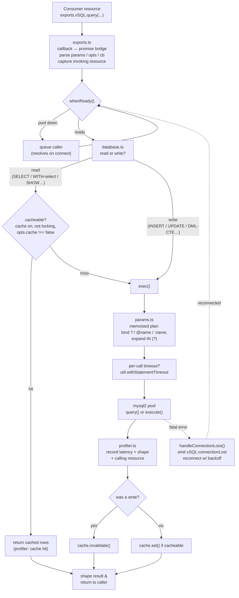

# Architecture

How a query travels through vSQL, and what each module owns. Useful if you're
contributing, debugging, or just curious what happens between your `await` and
the database.

## At a glance

A call enters through an **export**, waits for the pool to be **ready**, is
classified as a **read or write**, has its parameters **bound**, runs on a pooled
**mysql2** connection, is **recorded** by the profiler, and (for writes)
**invalidates** the cache before the shaped result returns to the caller.

## Query lifecycle

## Step by step

1. **Export entry** (`exports.ts`) - normalises the `(sql, params?, opts?, cb?)`
   arguments, bridges callback and Promise styles, and captures the calling
   resource via `GetInvokingResource()` for profiling.
2. **Readiness gate** (`gate.ts`) - if the pool isn't up yet (startup or a
   reconnect), the call queues on `whenReady()` and resolves the moment it
   connects, rather than throwing.
3. **Classification** (`database.ts` + `util.ts`) - the statement is judged a
   read or a write (`SELECT` / `WITH`-select / `SHOW` are reads; a CTE ending in
   DML is a write).
4. **Cache check** (`cache.ts`) - cacheable reads (caching on, not a locking
   read, not opted out) are served from the TTL + LRU cache on a hit.
5. **Binding** (`params.ts`) - parameters are bound positionally from a memoised
   per-SQL plan; `IN ?` expands to `IN (?, ?, ...)`. Values are always bound,
   never interpolated.
6. **Execution** - the statement runs on a pooled mysql2 connection, optionally
   wrapped with a per-call server-side timeout.
7. **Recording** (`profiler.ts`) - latency, query shape, and the calling resource
   are recorded; slow queries are logged.
8. **Invalidate / cache** - a write clears the result cache; a cacheable read
   stores its rows.
9. **Shape & return** - the result is shaped to the method's contract (`single` →
   row, `scalar` → value, `insert` → id, `update` → affected rows) and returned.

If a fatal connection error surfaces at execution, `handleConnectionLoss()` drops
the dead pool, emits `vSQL:connectionLost`, and reconnects with backoff;
in-flight callers wait on the gate and resume on `vSQL:reconnected`.

## Modules

| Module | Responsibility |
|---|---|
| `index.ts` | Bootstrap: load config, register exports/commands/compat, print banner, start the pool, run migrations, wire `onResourceStop`. |
| `config.ts` | Parse convars (URL / semicolon / discrete), build `PoolOptions`, session statements, redacted summary, validation warnings. |
| `exports.ts` | Register FiveM exports; bridge Promise ↔ callback; normalise `(sql, params?, opts?, cb?)`; capture the invoking resource. |
| `database.ts` | The pool, connection lifecycle (connect / reconnect / drain), the query API, cache wiring, slow-query logging. |
| `gate.ts` | The readiness gate - queue callers while the pool is down, release them on connect. |
| `params.ts` | Placeholder binding - `?`, `@name`, `:name`, `IN (?)` expansion - with a memoised per-SQL plan. Always bound, never interpolated. |
| `retry.ts` | The transaction-with-retry loop: run in a transaction, roll back and replay on deadlock / lock-wait. |
| `shape.ts` | Pure result shaping (`single` / `scalar` / `insert` / `update`) and transaction-entry normalisation. |
| `cache.ts` | TTL + LRU result cache with substring invalidation. |
| `profiler.ts` | Counters, latency ring buffer + percentiles, slow-query log, per-shape and per-resource aggregation. |
| `util.ts` | Pure helpers: read/write classification, cacheability, backoff, fatal/retryable error detection, connection hints, statement-timeout wrapping. |
| `typecast.ts` | Opt-in oxmysql-compatible result casting (dates → ms, `TINYINT(1)` / `BIT(1)` → bool). |
| `compat.ts` | Claim the oxmysql / ghmattimysql / mysql-async export namespaces and route them in. |
| `server.ts` | Detect MySQL vs MariaDB and `RETURNING` support. |
| `migrations.ts` | Discover, checksum, lock, apply / rollback / status. |
| `commands.ts` | The `vsql` console command and its subcommands. |
| `version.ts` | Best-effort GitHub release check on startup. |
| `banner.ts` / `logger.ts` | Console UI - startup banner, status box, tagged/coloured logging. |

## Design choices

- **Bind, never interpolate.** Every value goes through `params.ts` as a bound
  `?`, so queries are injection-safe by construction. The binding plan caches a
  query's *structure*, never its values.
- **Queue, don't fail, during startup/reconnect.** Calls made before the pool is
  up wait on `whenReady()` instead of throwing.
- **Blunt but correct cache invalidation.** Any write clears the whole result
  cache; targeted clears are opt-in via `cacheClear(pattern)`. A stale read is a
  correctness bug; a cache miss is just a round-trip.
- **Replay deadlocks, not bugs.** Transactions and batches retry only on InnoDB
  deadlock / lock-wait timeout, rolling back whole between attempts.
- **Pure core, testable.** The hot-path logic (`params`, `util`, `cache`,
  `profiler`, `shape`, `retry`, `gate`, `typecast`) has no FiveM or DB
  dependencies, so it runs under `node --test`. The full suite is ~90 tests.

## Performance notes

- **Memoised binding plans.** A SQL string's structure is analysed once and
  reused, so a query called repeatedly (the norm in a running server) skips
  re-parsing - parameter binding is several times faster than re-parsing every
  call. See the [benchmarks](https://github.com/valerisn/vSQL/tree/main/benchmarks).
- **O(1) profiling.** Latency samples live in a fixed-size ring buffer and shapes
  in bounded maps, so profiling never grows unbounded or slows the hot path.
- **Prepared-statement reuse.** `execute()` uses mysql2's prepared-statement LRU
  per connection, so repeated statements skip re-preparing.
